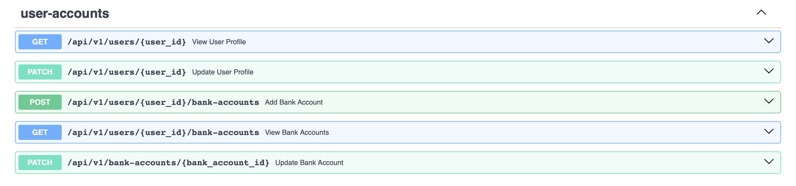

# Adaptive API Deception Prototype – Digital Wallet API

## Overview
This repository contains **RASD**, a cloud-based adaptive deception system for API endpoints.

RASD aims to enhance API security by intercepting API traffic, analyzing request behavior, and dynamically engaging suspicious activity using realistic decoy APIs, while allowing legitimate traffic to reach real backend services.

At a high level, the system:
- Intercepts incoming API traffic using a reverse proxy
- Analyzes request behavior using machine learning and threat intelligence
- Dynamically decides whether traffic is legitimate or suspicious
- Forwards legitimate traffic to real backend services
- Redirects suspicious traffic to realistic digital-twin API decoys
- Collects logs and attacker interaction data for analysis

This project is developed for **academic and research purposes**.

---

## System Components
The RASD system consists of the following components:

- **Customer Backend APIs** – Realistic backend services protected by RASD  
- **Reverse Proxy Layer** – Intercepts and controls all incoming API traffic  
- **Digital-Twin API Decoys** – Synthetic APIs that replicate real endpoint behavior  
- **Anomaly Detection Engine** – Identifies abnormal or suspicious API behavior  
- **Threat Intelligence Integration** – Enriches traffic analysis using known threat data  
- **Adaptive Decision Engine** – Determines how each request is handled  
- **Monitoring & Dashboard** – Provides logs, alerts, and visibility into interactions  

---

## Customer Backend APIs
Customer backend APIs represent the applications being protected by the RASD system.  
These APIs are intentionally designed to be realistic, consistent, and worth interacting with.

### Digital Wallet API
A **Digital Wallet backend system** is implemented as a representative customer API.  
It simulates common functionality found in fintech and financial applications.


### Available Endpoints

#### User Accounts
- View user profile  
- Update user profile  
- Add bank account  
- View bank accounts  
- Update bank account  

#### Wallet Operations
- View wallet balance  
- Transfer funds to another user  
- Transfer funds to bank account  
- Top up wallet balance  
- Withdraw funds  
- Pay bills  

#### Payments/Transactions
- View user payments  
- View payment details  

#### Admin Operations
- View all registered users  
- View all wallets  
- View all transactions  
- View system financial overview  

#### User Authentication
- User sign up  
- User sign in  
- User sign out

#### Admin Authentication
- Admin sign in  
- Admin sign out  

---

## API Reference
Interactive API documentation is available through **Swagger UI** once the backend server is running.



---
## Technology Stack (Current Phase)

| Component | Technology |
|-----------|------------|
| Framework | FastAPI (Python) |
| API Style | REST |
| Documentation | OpenAPI / Swagger |
| Server | Uvicorn |
| Database | SQLite + SQLAlchemy ORM |
| Proxy | FastAPI Reverse Proxy (httpx) |

---

## Architecture
```
User / Client
     │
     ▼
┌────────────────────────────────────┐
│   Reverse Proxy (:8080)            │  ← All traffic enters here
│   - Logs to proxy_logs.db          │
│   - Forwards to backend            │
│   - Adds X-From-Proxy              │
└─────────────────┬──────────────────┘
                  │
                  ▼
┌────────────────────────────────────┐
│   Backend API (:8000)              │  ← Only accessible through proxy
│   - Validates proxy header         │
│   - Processes requests             │
│   - Logs to digital_wallet.db      │
└─────────────────┬──────────────────┘
                  │
                  ▼
┌────────────────────────────────────┐
│   Two Separate Databases           │
├────────────────────────────────────┤
│  digital_wallet.db                 │
│  └─ Customer data & audit          │
│                                    │
│  proxy_logs.db                     │
│  └─ RASD traffic logs              │
└────────────────────────────────────┘
```

**Security Model:**
- The backend is completely isolated — direct access returns `403 Forbidden`
- All requests must pass through the proxy (`X-From-Proxy: 1` header)
- Only the `/health` endpoint is accessible directly on the backend
- All state-changing operations are logged to the audit table

---

## Repository Structure

```
RASD_adaptive-api-deception/
│
├── backend_api/                  # Customer backend API
│   ├── main.py                   # FastAPI app, middleware, router registration
│   ├── db/
│   │   ├── database.py           # SQLAlchemy engine and session setup
│   │   ├── models.py             # ORM models (User, Wallet, Transaction, etc.)
│   │   ├── audit_helper.py       # Audit logging helper functions
│   │   └── seed_data.py          # Database seeding script
│   └── routers/
│       ├── user_authentication.py
│       ├── admin_authentication.py
│       ├── user_accounts.py
│       ├── wallet.py
│       └── admin_operations.py
│
├── proxy/                        # Reverse proxy layer
│   ├── main.py                   # Transparent reverse proxy (httpx)
│   ├── db/
│   │   ├── database.py           # Proxy database connection
│   │   ├── models.py             # ProxyRequest model
│   │   └── logger.py             # Request logging helper
│   └── __init__.py
│
├── dashboard/                    # Monitoring dashboard
├── detection/                    # Anomaly detection engine
├── decoy_api/                    # Digital-twin decoy APIs
├── digital_wallet.db             # Backend database (auto-created on startup)
├── proxy_logs.db                 # Proxy logs database (auto-created on startup)
├── requirements.txt              # Python dependencies
└── README.md
```

---

## Setup & Installation

### Prerequisites
- Python 3.9 or later
- Git

### 1. Clone the Repository

```bash
git clone https://github.com/WedAbdullh/RASD_adaptive-api-deception.git
cd RASD_adaptive-api-deception
```

### 2. Create and Activate Virtual Environment

```bash
python -m venv venv
source venv/bin/activate        # macOS/Linux
venv\Scripts\activate           # Windows
```

### 3. Install Dependencies

```bash
pip install -r requirements.txt
```

Or manually:

```bash
pip install fastapi uvicorn sqlalchemy httpx pydantic[email]
```

### 4. Seed the Database

Populate the database with test data (users, wallets, transactions, admin):

```bash
python -m backend_api.db.seed_data
```

Expected output:
```
Creating database tables...
Seeding database with test data...
✓ Created 3 users
✓ Created 3 bank accounts
✓ Created 3 wallets
✓ Created 3 transactions
✓ Created 3 payments
✓ Created admin account
✅ Database seeded successfully!
```

### 5. Run the Backend Server

```bash
uvicorn backend_api.main:app --reload --port 8000
```

Expected output:
```
INFO:     Uvicorn running on http://127.0.0.1:8000
✅ Database initialized
INFO:     Application startup complete.
```

### 6. Run the Proxy Server

Open a new terminal window:

```bash
source venv/bin/activate
uvicorn proxy.main:app --reload --port 8080
```

Expected output:
```
INFO:     Uvicorn running on http://127.0.0.1:8080
INFO:     Application startup complete.
```

---

## Testing the API

> ⚠️ **All API access must go through the proxy on port 8080.**
> Direct backend access on port 8000 will return `403 Forbidden`.

### Swagger UI
```
http://127.0.0.1:8080/docs
```

### Health Check
```
http://127.0.0.1:8000/health
```
Expected response:
```json
{ "status": "ok", "service": "digital-wallet-api" }
```

### Test Credentials

| Role | Credential | Value |
|------|-----------|-------|
| User | Email | `user@example.com` |
| User | Password | `password123` |
| Admin | Username | `admin` |
| Admin | Password | `admin123` |

### Test Flow

1. **Login** → `POST /api/v1/auth/sign-in` or `POST /api/v1/admin/auth/sign-in`
2. **Copy the token** from the response
3. **Use token** in the `X-User-Token` or `X-Admin-Token` header for protected endpoints
4. **Test wallet operations**, admin views, etc.

---

## Database

The system uses **SQLite** with **SQLAlchemy ORM** for persistent storage across two separate databases.

### Database Files

Both databases are auto-created in the project root on first startup:
```
digital_wallet.db       ← Customer backend API data
proxy_logs.db          ← RASD proxy traffic logs
```

### 1. Backend API Database (`digital_wallet.db`)
Customer application data - managed by the backend API.

| Table | Description |
|-------|-------------|
| `users` | Registered user accounts |
| `wallets` | User wallets with balances |
| `transactions` | All wallet transactions |
| `payments` | Payment records |
| `bank_accounts` | Linked bank accounts |
| `user_sessions` | Active user session tokens |
| `admin_sessions` | Active admin session tokens |
| `admins` | Admin accounts |
| `audit_logs` | Audit trail of backend operations |

### 2. Proxy Logs Database (`proxy_logs.db`)
RASD system logs - captures all HTTP traffic through the proxy for anomaly detection and security monitoring.

| Table | Description |
|-------|-------------|
| `proxy_requests` | Complete log of all HTTP requests passing through the reverse proxy |

**Schema - All Logged Fields:**

| Field | Type | Description | Example |
|-------|------|-------------|---------|
| `id` | Integer | Auto-incrementing primary key | `1`, `2`, `3` |
| `request_id` | String | Unique UUID for each request | `a1b2c3d4-e5f6-...` |
| `timestamp` | DateTime | When request was received | `2026-02-17 10:30:45` |
| `client_ip` | String | Client IP address (supports X-Forwarded-For) | `192.168.1.100` |
| `method` | String | HTTP method | `GET`, `POST`, `PUT`, `DELETE` |
| `path` | String | Request URL path | `/api/v1/auth/sign-in` |
| `query_params` | JSON | URL query parameters | `{"limit": 10, "offset": 0}` |
| `headers` | JSON | Request headers (auth tokens redacted) | `{"user-agent": "...", "x-user-token": "***REDACTED***"}` |
| `body` | Text | Request body (max 10KB) | `{"email": "user@example.com"}` |
| `response_status` | Integer | HTTP response status code | `200`, `403`, `500` |
| `response_time_ms` | Integer | Response time in milliseconds | `45`, `1203` |
| `forwarded_to_backend` | Boolean | Whether request was forwarded to backend | `true`, `false` |
| `backend_error` | String | Error message if backend unreachable | `"Backend unavailable"`, `"Timeout"` |
| `flagged_as_suspicious` | Boolean | Marked as suspicious by detection engine | `false` *(future use)* |
| `suspicion_reason` | String | Reason for flagging | `null` *(future use)* |
| `created_at` | DateTime | Database record creation timestamp | `2026-02-17 10:30:45` |

**Note:** Fields marked for future use (suspicious flags) currently have default values and will be populated when the anomaly detection engine is integrated.

**Security Features:**
- Authentication tokens are automatically redacted (`***REDACTED***`)
- Request body size limited to 10KB to prevent database bloat
- All timestamps use UTC timezone


### Viewing the Databases

**SQLite CLI:**
```bash
# Backend database
sqlite3 digital_wallet.db
.mode column
.headers on
SELECT * FROM users;
SELECT * FROM audit_logs ORDER BY created_at DESC LIMIT 10;
.quit

# Proxy logs
sqlite3 proxy_logs.db
SELECT * FROM proxy_requests ORDER BY timestamp DESC LIMIT 10;
.quit
```

**VS Code:** Install the **SQLite Viewer** extension by Florian Klampfer, then click the `.db` files in the file explorer.

### Audit Logging

#### **Backend Audit Logs** (`digital_wallet.db` → `audit_logs` table)

Tracks all state-changing operations within the customer API:

| Category | Events Logged |
|----------|--------------|
| Authentication | User/admin login, logout, failed login attempts |
| Wallet Operations | Top up, withdraw, user-to-user transfer, bill payment |
| Account Changes | Profile updates, bank account addition/modification |
| Admin Actions | Admin viewing users, wallets, transactions |
| Failures | Insufficient balance, invalid credentials, unauthorized access |


---

## Elastic Stack Monitoring Setup

The RASD system uses the **Elastic Stack (Elasticsearch, Logstash, and Kibana)** to monitor and analyze API traffic generated by the reverse proxy.

The monitoring layer enables:

- Real-time log collection
- Security monitoring
- API traffic analysis
- Detection of suspicious activity

All API traffic passing through the proxy is stored in the **proxy_logs.db** database and then processed by Logstash before being indexed in Elasticsearch and visualized in Kibana.

---

## Elastic Stack Components

The Elastic Stack consists of three main tools:

| Component | Purpose |
|----------|---------|
| Elasticsearch | Stores and indexes logs |
| Logstash | Collects and processes logs |
| Kibana | Visualizes logs and dashboards |

---

## Installing Elasticsearch

Elasticsearch is responsible for storing and indexing logs.

### Install Elasticsearch (macOS)

```bash
brew tap elastic/tap
brew install elastic/tap/elasticsearch-full
```

### Start Elasticsearch

```bash
brew services start elastic/tap/elasticsearch-full
```

### Verify Elasticsearch Installation

Open in the browser:

```
http://localhost:9200
```

Expected response:

```json
{
  "name": "localhost",
  "cluster_name": "elasticsearch"
}
```

---

## Installing Logstash

Logstash is responsible for extracting logs from the proxy database and sending them to Elasticsearch.

### Install Logstash

```bash
brew install elastic/tap/logstash-full
```

### Create Logstash Pipeline

make sure you pulled the Pipeline file:

```
logstash/pipeline.conf

```

### Run Logstash

```bash
logstash -f logstash/pipeline.conf
```

Logstash will read logs from the proxy database and send them to Elasticsearch.

---

## Installing Kibana

Kibana is used to visualize and analyze logs stored in Elasticsearch.

### Install Kibana

```bash
brew install elastic/tap/kibana-full
```

### Start Kibana

```bash
brew services start elastic/tap/kibana-full
```

### Open Kibana

Open the following URL in your browser:

```
http://localhost:5601
```

---

## Creating a Kibana Index Pattern

1. Open Kibana  
2. Navigate to:

```
Stack Management → Index Patterns
```

3. Click:

```
Create Index Pattern
```

4. Enter the index name:

```
rasd-api-logs
```

---

## Monitoring Architecture

The monitoring pipeline in this project works as follows:

```
Client Request
      │
      ▼
Reverse Proxy
      │
      ▼
proxy_logs.db
      │
      ▼
Logstash
      │
      ▼
Elasticsearch
      │
      ▼
Kibana Dashboard
```

1. The **Reverse Proxy** intercepts all API traffic.
2. Each request is stored in **proxy_logs.db**.
3. **Logstash** extracts logs from the database.
4. Logs are indexed and stored in **Elasticsearch**.
5. **Kibana** visualizes the logs using dashboards.

---

## Benefits of Using the Elastic Stack

Using Elasticsearch, Logstash, and Kibana provides several advantages for the RASD system:

- Real-time monitoring of API traffic
- Detection of suspicious activity
- Visualization of system behavior
- Analysis of response times and errors
- Investigation of potential attacks

This monitoring layer improves the **security visibility and detection capabilities** of the RASD platform.

---

---

## API Reference

Interactive API documentation is available through Swagger UI at:
```
http://127.0.0.1:8080/docs
```
---

## Authors
- Rama Alguthmi  
- Wed Alotaibi  
- Taif Alsaadi  
- Rahaf Lamphon  

---

## Acknowledgments

---

## Contact
📧 Contact information will be added.
